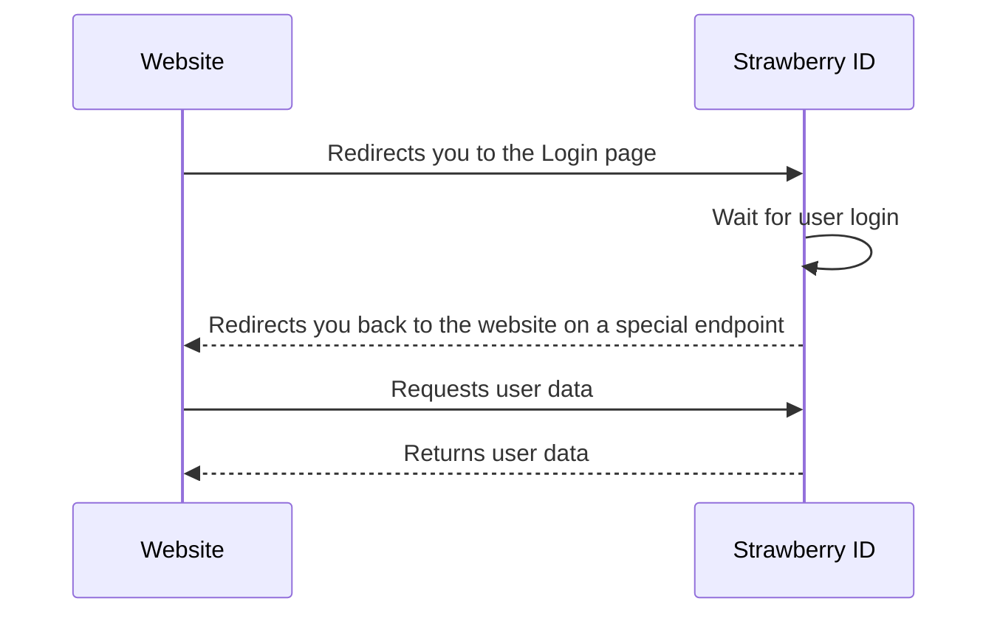
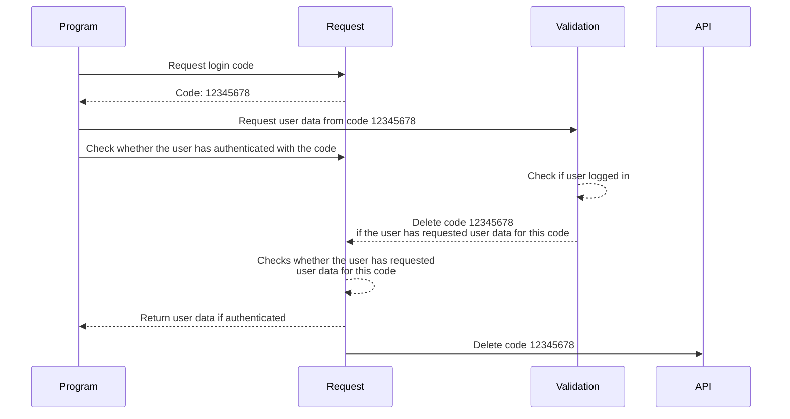
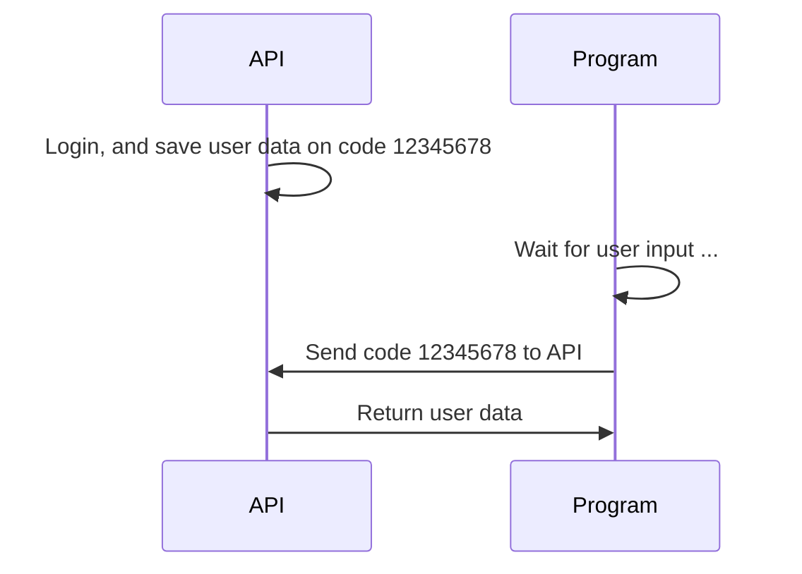

# Die Basics
[Strawberry ID](https://id.strawberryfoundations.org/v2/de/login) ist unser universelles Login-System für unsere Produkte. 
Dieses ist nicht nur extrem flexibel und universell, es kann sogar verwendet werden um die Strawberry ID mit nicht-hauseigenen Produkten zu verwenden.

Auf der [Verwendungsseite von Strawberry ID](/german/strawberry-id/usage) kannst du mehr erfahren, wie du Strawberry ID in deiner Website integrierst!

# Wie es funktioniert
Strawberry ID arbeitet mit einem sogenannten "Code Login System" welches Nutzern ermöglicht sich mit nur einem einfachen Code auf einer Website oder in einem Programm anzumelden.
Wir haben außerdem ein Sicherheitssystem eingebaut, welches dir anzeigt, ob die von dir besuchte Website sicher ist oder nicht.

<Warning>
    Wir haften an keinen Schäden, die an deinem Account vorkommen, wenn du dich auf nicht-verifizierten Websiten mit Strawberry ID anmeldest.
</Warning>

# Web-Login
Das Anmelden auf Websiten funktioniert super einfach. Unsere Websiten (z.B. unsere [Main-Seite](https://strawberryfoundations.org/de)) bieten einen einfachen Login-Button.
Wenn du dort drauf klickst weiß Strawberry ID direkt, woher du kommst, und leitet dich anschließend auch wieder weiter. 

# OAuth-Login
Der OAuth-Login ist der Nachfolger des Service-Logins und ist sicherer, da du einen Code vorgegeben bekommst, 
mit dem du dich bei unserer Strawberry ID Website anmelden kannst. Erst bei der Authentifizierung werden deine Account-Daten auf diesen Code gespeichert
und anschließend ruft das Programm mithilfe unserer API die Daten ab. 

# Service-Login
<Warning>
    Der Service-Login ist seit v2 unserer API nicht mehr verfügbar. Bitte verwende stattdessen die OAuth Methode
</Warning>

Der Service-Login funktioniert anders als der Web-Login. Du erhälst einen Code, den du deinem Programm eingeben musst (z.B. Strawberry Chat).
Mithilfe des Codes, weiß Strawberry Chat wer du bist, und empfängt deine Nutzerdaten.

